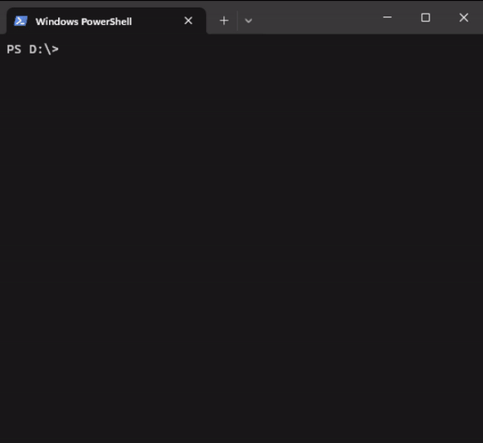

# pvm

> PHP Version Manager

A simple command line tool to manage multiple PHP versions on your machine.

## Installation

### Direct download

Download the latest version of `pvm.exe` from [GitHub releases] and place it in a directory that is in your `PATH`
environment variable.

[GitHub releases]: https://github.com/ricardoboss/pvm/releases
